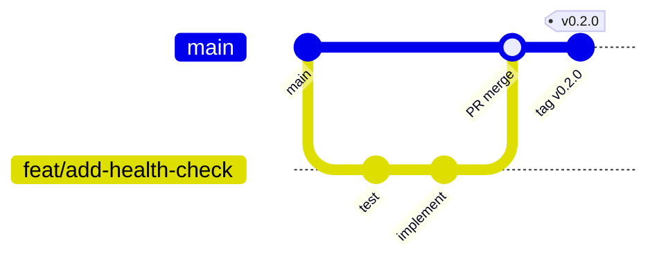

# Branch Strategy and Development Workflow

All branch names, commits, and PRs **must be written in English**.

## Overview

This project uses **trunk-based development** with short-lived topic branches. All work merges into `main` via pull request. Releases are cut from `main` using Git tags.



## Permanent branches

| Branch | Purpose | Who pushes | Direct push |
|--------|---------|------------|-------------|
| `main` | Single source of truth; always deployable | Maintainers via merged PR only | **No** |

There are no long-lived `develop`, `staging`, or `release/*` branches. Environment promotion happens via tags, feature flags, and deployment pipelines — not separate git branches.

## Topic branches (where you commit)

**Never commit directly to `main`.** Create a topic branch from the latest `main`, do your work there, then open a PR back to `main`.

| Prefix | Use when | Example |
|--------|----------|---------|
| `feat/` | New feature or behavior | `feat/order-idempotency` |
| `fix/` | Bug fix | `fix/token-rotation-expiry` |
| `refactor/` | Code change, no behavior change | `refactor/extract-order-aggregate` |
| `test/` | Tests only | `test/inventory-stock-rejection` |
| `docs/` | Documentation only | `docs/branch-strategy` |
| `chore/` | Tooling, deps, housekeeping | `chore/dependabot-config` |
| `ci/` | CI/CD pipeline changes | `ci/add-integration-tests` |
| `perf/` | Performance improvement | `perf/batch-order-fetch` |
| `hotfix/` | Urgent production fix | `hotfix/auth-bypass-patch` |

### Naming rules

- Lowercase with hyphens: `feat/add-health-endpoint`
- Short and descriptive (3–5 words max)
- No issue numbers in branch name (link issue in PR instead)
- English only

## Who commits where

| Contributor type | Flow |
|------------------|------|
| **Maintainer / team member** | Branch from `main` → commit on topic branch → PR to `main` |
| **External contributor (fork)** | Fork repo → branch from fork's `main` → commit on topic branch → PR to upstream `main` |

In both cases, commits land on a **topic branch**, never on `main` directly.

## Standard development flow

### 1. Sync with main

```bash
git checkout main
git pull origin main
```

### 2. Create a topic branch

```bash
git checkout -b feat/short-description
```

### 3. Develop with TDD

1. Write a failing test (Red)
2. Implement minimal code (Green)
3. Refactor while tests pass
4. Commit in small, logical steps — see [commits.md](commits.md)

```bash
git add .
git commit -m "feat(orders): add idempotent order creation endpoint"
```

### 4. Keep branch up to date (if main moved)

Prefer **rebase** for a clean history on topic branches:

```bash
git fetch origin
git rebase origin/main
```

If the branch was already pushed, update with care:

```bash
git push --force-with-lease origin feat/short-description
```

Use merge instead of rebase only when multiple people work on the same branch.

### 5. Validate locally before pushing

```bash
make check
```

This enforces the branch guard and runs the same checks as CI. See [development-setup.md](development-setup.md).

### 6. Push and open a PR

```bash
git push -u origin feat/short-description
```

Open a pull request targeting **`main`**. See [pull-requests.md](pull-requests.md).

### 7. CI must pass

Every push to a topic branch and every PR to `main` triggers CI. All checks must be green before merge.

### 8. Review and merge

- At least one approval (when team policy applies)
- All review threads resolved
- Squash merge recommended for clean history (single commit per PR)

```bash
# After squash merge on GitHub, locally:
git checkout main
git pull origin main
git branch -d feat/short-description
```

### 9. Delete the topic branch

Delete remote branch after merge (GitHub option: "Delete branch" on PR merge).

## Commit destination cheat sheet

| Action | Target branch |
|--------|---------------|
| New feature | `feat/*` → PR → `main` |
| Bug fix | `fix/*` → PR → `main` |
| Documentation | `docs/*` → PR → `main` |
| CI/CD change | `ci/*` → PR → `main` |
| Release version bump | `chore/release-vX.Y.Z` → PR → `main` → tag |
| Hotfix | `hotfix/*` → PR → `main` → tag (patch) |
| Experiments / spikes | `feat/*` or `chore/spike-*` → PR or discard |
| **Direct push** | **`main` only via merged PR** |

## Hotfix flow

For urgent production issues on a released version:

```bash
git checkout main
git pull origin main
git checkout -b hotfix/critical-auth-fix

# fix + tests + commit
git push -u origin hotfix/critical-auth-fix
# Open PR → merge to main
```

After merge:

1. Update `CHANGELOG.md` and `VERSION` (patch bump)
2. Tag and push: `v0.1.1` — see [versioning.md](versioning.md)
3. Release workflow creates GitHub Release

## Release flow

Releases are **not** a separate branch. They are tags on `main`.

```bash
# On main, after changelog and VERSION are updated via PR:
git tag -a v0.2.0 -m "v0.2.0"
git push origin v0.2.0
```

See [versioning.md](versioning.md) for the full process.

## What not to do

| Forbidden | Why |
|-----------|-----|
| Push directly to `main` | Bypasses review and CI |
| Long-lived feature branches (> 1 week) | Increases merge conflicts |
| Commit secrets or `.env` files | Security risk |
| Force-push to `main` | Destroys shared history |
| Mix unrelated changes in one branch/PR | Hard to review and revert |
| Portuguese in branch names or commits | Project language policy |

## Branch protection (GitHub settings)

Configure on `main`:

- [ ] Require pull request before merging
- [ ] Require status checks to pass (`validate` / future CI jobs)
- [ ] Require branches to be up to date before merging
- [ ] Do not allow bypassing the above settings
- [ ] Restrict force pushes
- [ ] Restrict deletions

## Quick reference: full lifecycle

```
issue/discussion
    ↓
git checkout main && git pull
    ↓
git checkout -b feat/my-feature
    ↓
TDD: test → implement → refactor → commit(s)
    ↓
git push -u origin feat/my-feature
    ↓
open PR → main
    ↓
CI green + review approved
    ↓
squash merge → main
    ↓
delete topic branch
    ↓
(if release) bump VERSION + CHANGELOG → PR → tag vX.Y.Z
```

## Related guides

| Guide | Topic |
|-------|-------|
| [development-setup.md](development-setup.md) | Local environment and commands |
| [commits.md](commits.md) | Commit message format |
| [pull-requests.md](pull-requests.md) | PR template and review |
| [ci-cd.md](ci-cd.md) | Pipeline and deployment |
| [versioning.md](versioning.md) | SemVer and releases |
