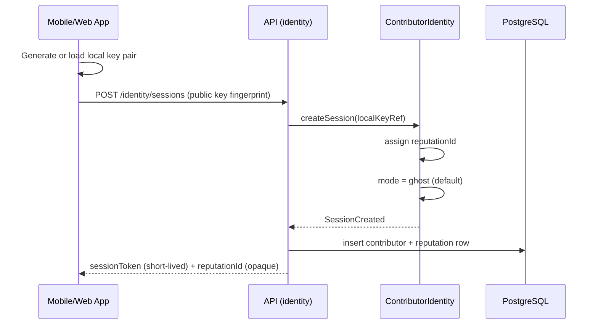
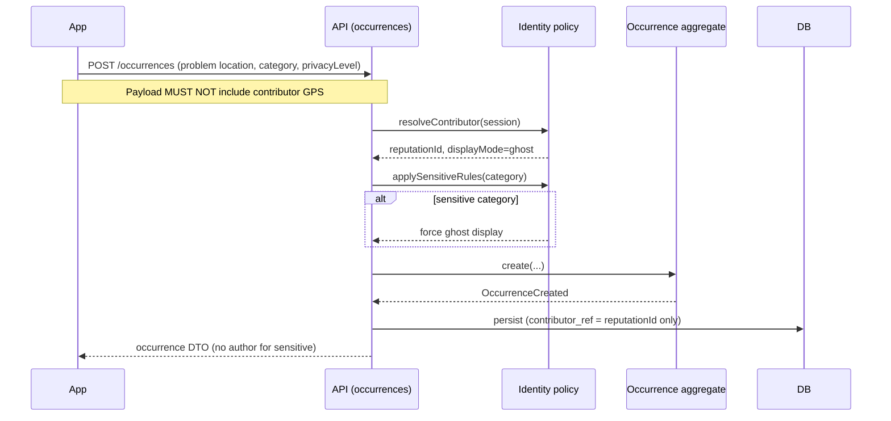
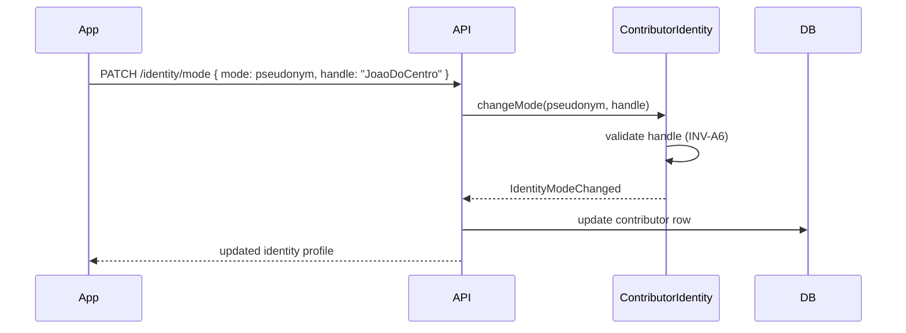
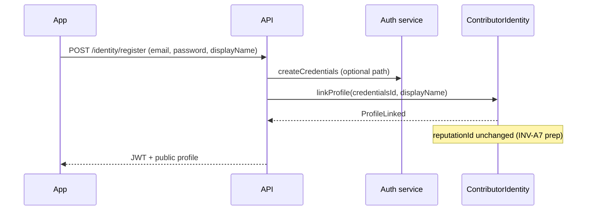
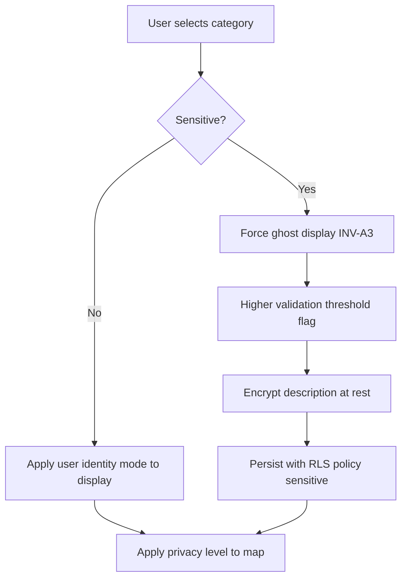
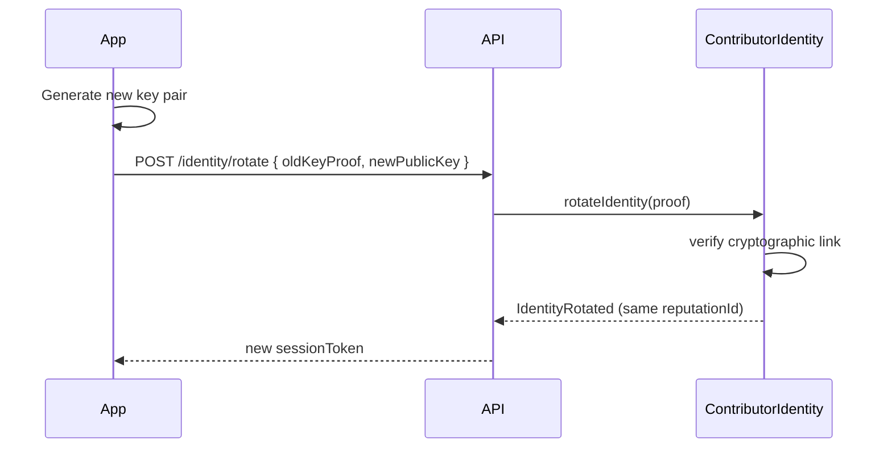
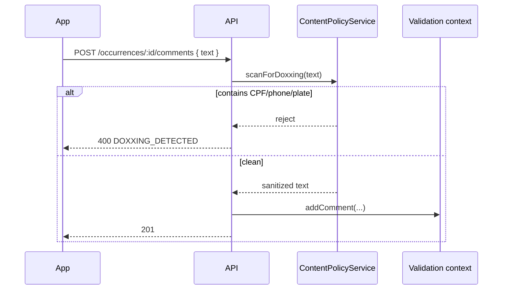

# Anonymity — Flows

User journeys, commands, and domain events for the Identity & Privacy bounded context.

## 1. First visit — anonymous session bootstrap

No signup screen. The app works immediately.

**Commands:** `BootstrapAnonymousSession`  
**Events:** `ContributorSessionCreated`, `ReputationIdentityAssigned`  
**Queries:** none (write-only bootstrap)

### Outcomes

| Result | User experience |
|--------|-----------------|
| Success | User lands on map; can report immediately |
| Rate limited | 429 — try later; no account prompt |
| Invalid key | 400 — regenerate local key |

---

## 2. Create occurrence as ghost (default path)

**Cross-context rule:** Occurrences context receives `ContributorRef` (reputation ID + display policy) — never raw identity document.

---

## 3. Upgrade ghost → pseudonym

Optional; never required to contribute.

**Commands:** `ChangeIdentityMode`  
**Events:** `IdentityModeChanged`  
**Failures:** handle taken → 409; profanity → 400; doxxing in handle → 400

---

## 4. Upgrade to public profile (optional traditional auth)

OAuth providers may be linked later — never as the only path (ADR-0004).

---

## 5. Sensitive report flow

**Display rule:** API response for sensitive occurrences **never** includes `author`, `pseudonym`, or `profileId` — only `trustedSourceLabel` aggregate.

---

## 6. Identity rotation (reputation preserved)

User escapes harassment or device loss without losing trust score.

---

## 7. Comment with anti-doxxing

---

## Command & query catalog (Identity context)

### Commands

| Command | Actor | Description |
|---------|-------|-------------|
| `BootstrapAnonymousSession` | App | First session; assigns reputation |
| `ChangeIdentityMode` | Contributor | ghost ↔ pseudonym ↔ public |
| `SetPseudonym` | Contributor | Set/update handle |
| `LinkPublicProfile` | Contributor | Optional email/password |
| `RotateIdentity` | Contributor | New keys, same reputation |
| `RevokeSession` | Contributor | Logout / discard session |

### Queries

| Query | Actor | Description |
|-------|-------|-------------|
| `GetMyIdentity` | Contributor | Mode, pseudonym, public name |
| `GetMyContributions` | Contributor | List by reputation ID (device-bound) |
| `GetPublicProfile` | Visitor | Only if user enabled public profile |

### Domain events

| Event | Consumers |
|-------|-----------|
| `ContributorSessionCreated` | Analytics (aggregated) |
| `ReputationIdentityAssigned` | Reputation context |
| `IdentityModeChanged` | Audit (no PII) |
| `IdentityRotated` | Security log |
| `SensitiveDisplayPolicyApplied` | Occurrences read model |

---

## Related docs

- [Business rules](business-rules.md)
- [Domain model](domain-model.md)
- [Occurrence lifecycle](../../system/occurrence-lifecycle.md)
