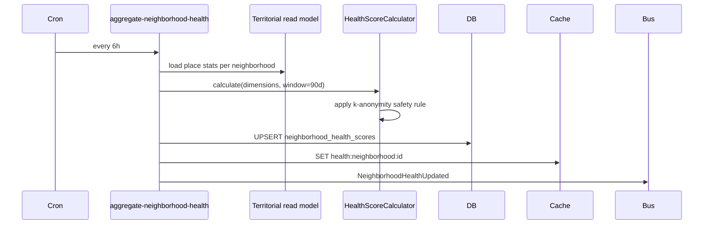
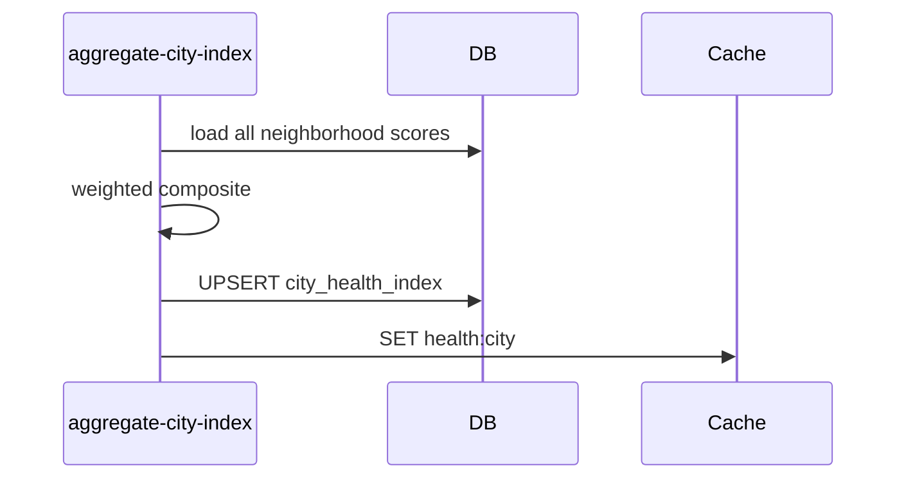
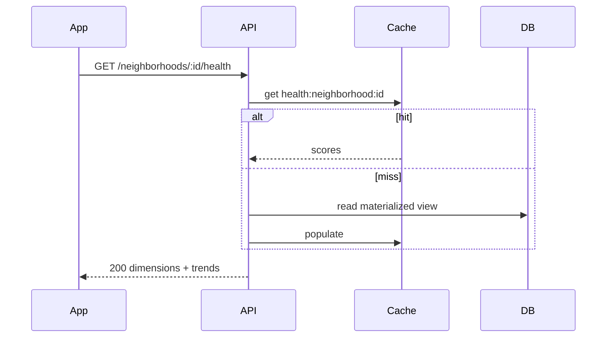
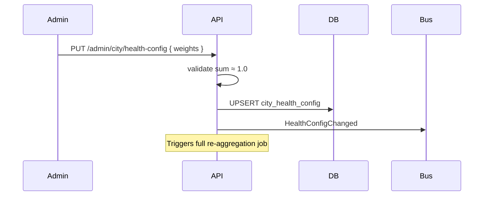

# City Health — Flows

## 1. Neighborhood aggregation (scheduled)



---

## 2. City index aggregation



Runs after neighborhood job completes.

---

## 3. Invalidate cache on occurrence resolution

```mermaid
sequenceDiagram
    participant Bus
    participant Worker

    Bus->>Worker: OccurrenceStatusChanged → resolved
    Worker->>Worker: DEL health:neighborhood:* (affected)
    Note over Worker: Next scheduled run refreshes; optional eager partial update v2
```

---

## 4. Public read — neighborhood health



**INV-H6:** Handler never calls calculator — read only.

---

## 5. Admin configure weights



---

## Command catalog

| Command | Trigger | Actor |
|---------|---------|-------|
| `AggregateNeighborhoodHealth` | cron / config change | worker |
| `AggregateCityIndex` | after neighborhood job | worker |
| `UpdateHealthConfig` | admin API | city_admin |

---

## Query catalog

| Query | HTTP |
|-------|------|
| `GetNeighborhoodHealth` | `GET /neighborhoods/:id/health` |
| `GetCityHealth` | `GET /city/health` |
| `GetNeighborhoodHealthHistory` | `GET /neighborhoods/:id/health/history?window=365d` |
| `GetHealthConfig` | `GET /admin/city/health-config` |

---

## Domain events

| Event | Consumers |
|-------|-----------|
| `NeighborhoodHealthUpdated` | Web cache, admin dashboards |
| `CityHealthIndexUpdated` | City dashboard |
| `HealthAlertTriggered` | When dimension < threshold (v2) |

---

## Related docs

- [Business rules](business-rules.md)
- [Domain model](domain-model.md)
- [Territorial memory flows](../territorial-memory/flows.md)
