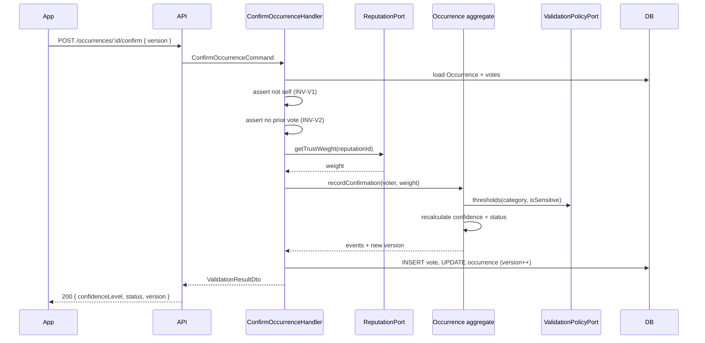
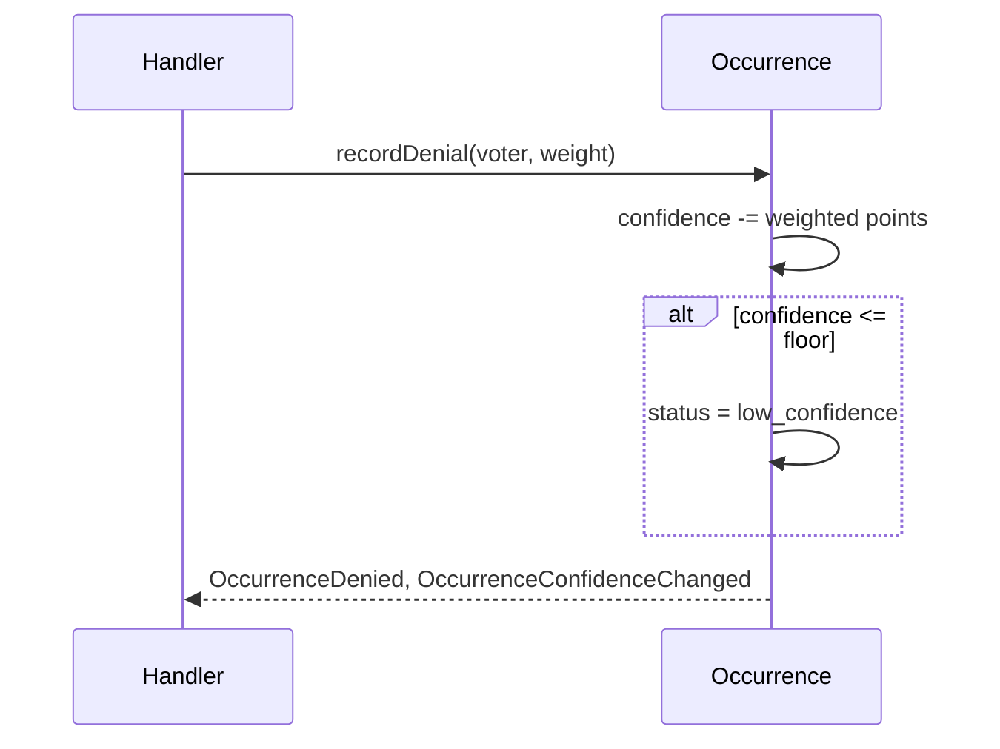
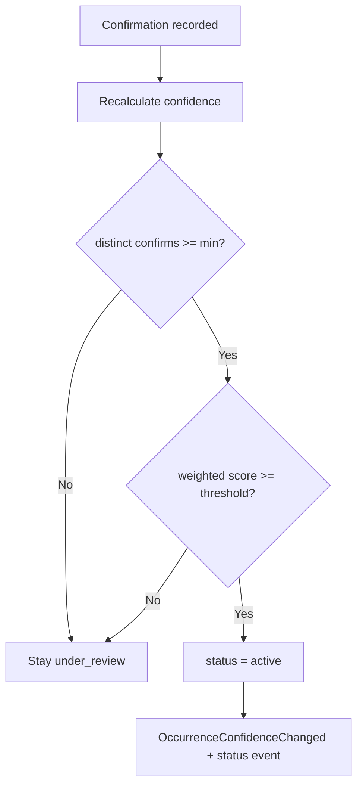
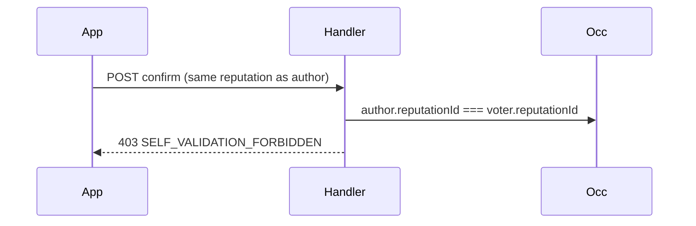
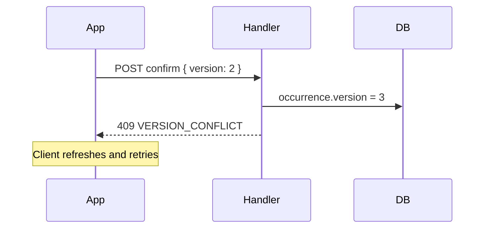
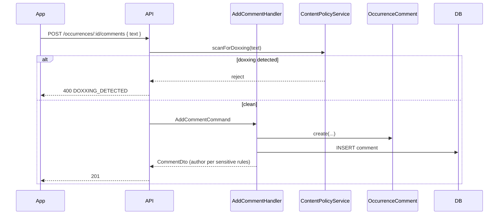
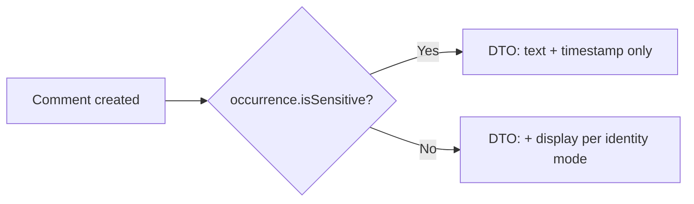

# Community Validation — Flows

## 1. Confirm occurrence (happy path)



---

## 2. Deny occurrence



---

## 3. Promote to active (consensus)



---

## 4. Self-validation blocked



---

## 5. Optimistic lock conflict



---

## 6. Add comment



Comments **do not** invoke `Occurrence.recordConfirmation`.

---

## 7. Sensitive thread — comment display



---

## Command catalog

| Command | HTTP | Idempotent |
|---------|------|------------|
| `ConfirmOccurrence` | `POST /occurrences/:id/confirm` | No — second call → 403 |
| `DenyOccurrence` | `POST /occurrences/:id/deny` | No |
| `AddComment` | `POST /occurrences/:id/comments` | No |
| `ListComments` | `GET /occurrences/:id/comments` | Read |

### `ConfirmOccurrence` errors

| Code | HTTP | When |
|------|------|------|
| `UNAUTHORIZED` | 401 | No session |
| `NOT_FOUND` | 404 | Unknown id or wrong tenant policy |
| `SELF_VALIDATION_FORBIDDEN` | 403 | INV-V1 |
| `ALREADY_VOTED` | 403 | INV-V2 |
| `VALIDATION_CLOSED` | 403 | resolved / deleted INV-V7 |
| `VERSION_CONFLICT` | 409 | INV-V10 |
| `RATE_LIMITED` | 429 | INV-V11 |

---

## Query catalog

| Query | Purpose |
|-------|---------|
| `GET /occurrences/:id/validation-summary` | Public counts: confirms, denies, confidence — no voter list |
| `GET /occurrences/:id/comments` | Paginated comments |

---

## Domain events

| Event | When |
|-------|------|
| `OccurrenceConfirmed` | After confirm persisted |
| `OccurrenceDenied` | After deny persisted |
| `OccurrenceConfidenceChanged` | Confidence or status changed |
| `OccurrenceStatusChanged` | Status transition (optional separate event) |
| `CommentAdded` | After comment persisted |

Event payloads exclude voter PII; sensitive threads exclude commenter identity.

---

## UI flows

### Validation sheet (mobile / web)

```text
1. User opens occurrence detail
2. Sees confidence bar + "X confirmations"
3. Actions: [Confirm] [Deny] [Comment]
4. If already voted → buttons disabled
5. If own report → "You reported this" — no vote buttons
6. Submit → optimistic UI → reconcile version on 409
```

---

## Related docs

- [Business rules](business-rules.md)
- [Domain model](domain-model.md)
- [Occurrence lifecycle](../../system/occurrence-lifecycle.md)
