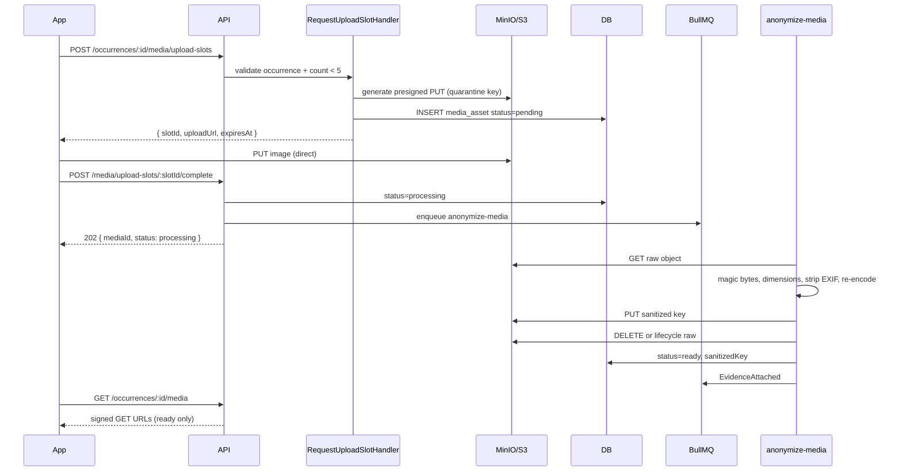
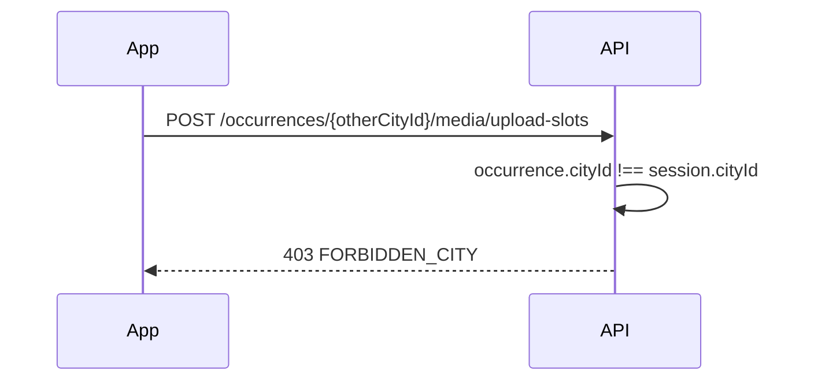
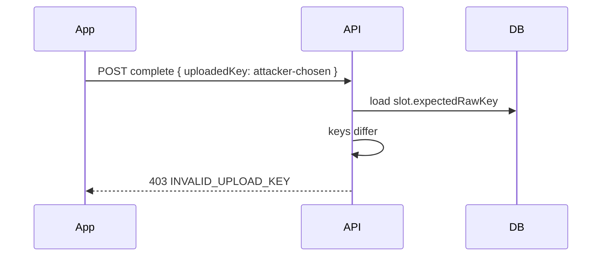
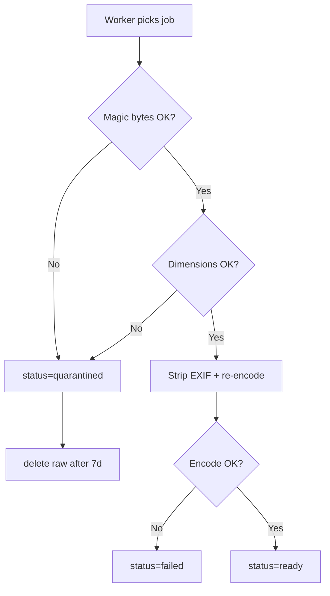
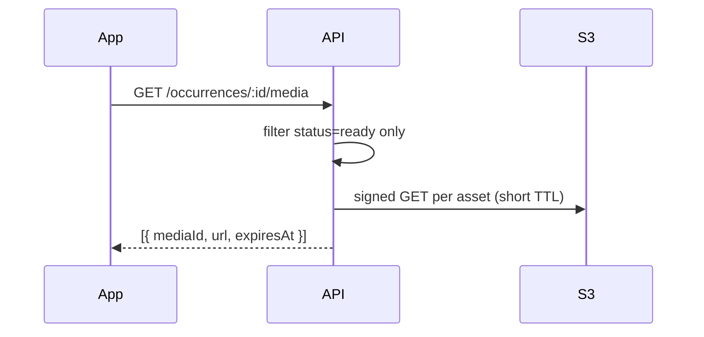

# Media Upload — Flows

## 1. End-to-end happy path



---

## 2. IDOR — wrong occurrence city



---

## 3. Slot key mismatch on complete



---

## 4. Worker failure paths



---

## 5. Expired presigned URL

```mermaid
sequenceDiagram
    participant App
    participant S3

    App->>S3: PUT after 15 min
    S3-->>App: 403 AccessDenied
    Note over App: Request new slot; old slot expires in DB
```

---

## 6. View media (public read)



Never return quarantine keys.

---

## Command catalog

| Command | HTTP | Description |
|---------|------|-------------|
| `RequestUploadSlot` | `POST /occurrences/:id/media/upload-slots` | Presigned PUT + pending record |
| `CompleteUpload` | `POST /media/upload-slots/:slotId/complete` | Verify + enqueue worker |
| `CancelUploadSlot` | `DELETE /media/upload-slots/:slotId` | Before upload — optional v1 |
| `ModeratorQuarantineMedia` | `POST /admin/media/:id/quarantine` | v2 |

### `RequestUploadSlot` body (v1)

```typescript
{
  contentType: 'image/jpeg' | 'image/png' | 'image/webp';
  contentLength: number; // client-declared, validated ≤ 10MB
}
```

### Errors

| Code | HTTP | When |
|------|------|------|
| `MEDIA_LIMIT_REACHED` | 403 | 5 images on occurrence |
| `FILE_TOO_LARGE` | 400 | contentLength > 10MB |
| `INVALID_CONTENT_TYPE` | 400 | MIME not allowed |
| `SLOT_EXPIRED` | 410 | complete after TTL |
| `INVALID_UPLOAD_KEY` | 403 | INV-M11 |
| `PROCESSING_FAILED` | — | terminal `failed` status |
| `RATE_LIMITED` | 429 | slot request flood |

---

## Query catalog

| Query | HTTP |
|-------|------|
| `ListOccurrenceMedia` | `GET /occurrences/:id/media` |
| `GetMediaStatus` | `GET /media/:id` (owner poll — optional) |

---

## Domain events

| Event | When | Consumers |
|-------|------|-----------|
| `UploadSlotIssued` | Slot created | Metrics |
| `MediaProcessingStarted` | Complete received | — |
| `MediaSanitized` | Worker success | — |
| `EvidenceAttached` | `ready` persisted | Occurrences audit, Validation (v2) |
| `MediaQuarantined` | Malicious / invalid | Security log |
| `MediaProcessingFailed` | Worker error | DLQ alert |

`EvidenceAttached` payload: `mediaId`, `occurrenceId`, `cityId` — no storage keys in public bus.

---

## Worker job: `anonymize-media`

```text
Input:  { mediaId, rawStorageKey, cityId, occurrenceId }
Steps:  fetch → validate → decode → strip EXIF → encode → upload sanitized → update DB → emit event
Retry:  3 attempts with backoff → DLQ
Idempotent: if already ready, skip
```

Queue: existing `apps/worker` BullMQ — see [monorepo structure](../../architecture/monorepo-structure.md).

---

## UI flow

```text
1. User opens occurrence detail
2. Tap "Add photo" (if count < 5)
3. Pick from gallery / camera
4. App requests slot → uploads to presigned URL
5. App calls complete → shows "Processing…"
6. Poll or websocket → thumbnail appears when ready
```

Map never shows `pending` / `processing` assets.

---

## Related docs

- [Business rules](business-rules.md)
- [Domain model](domain-model.md)
- [Occurrence creation](../occurrence-creation/flows.md)
