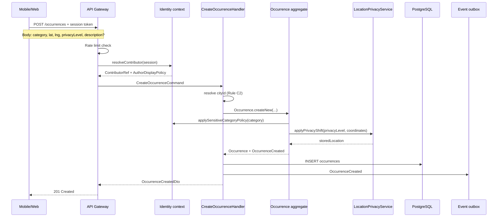
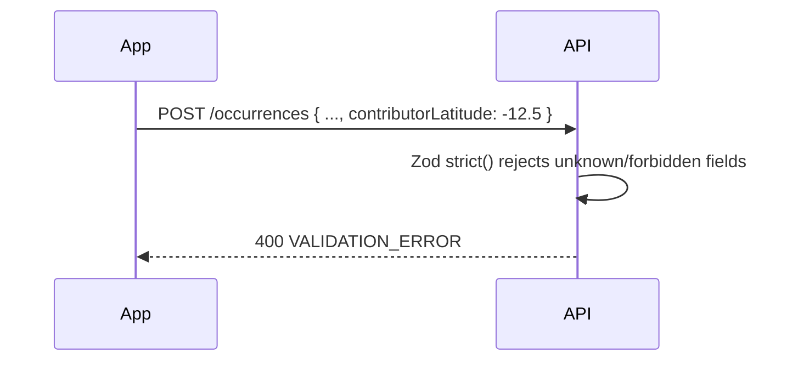
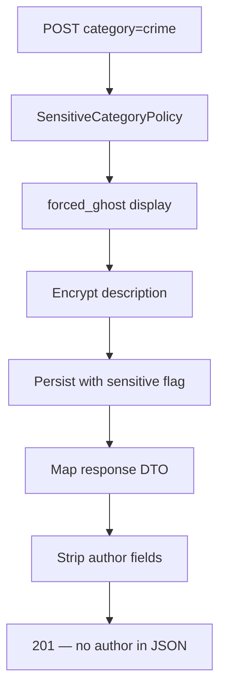
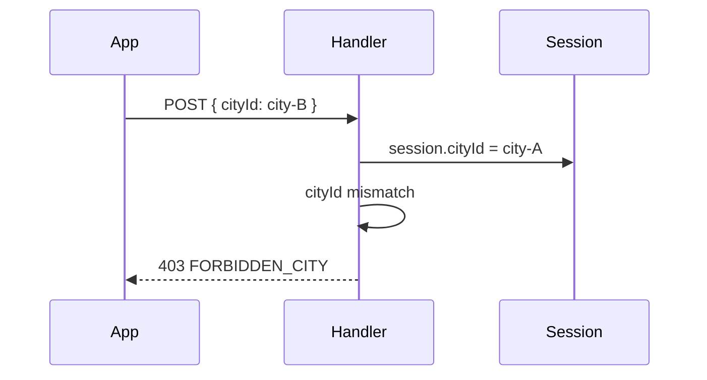
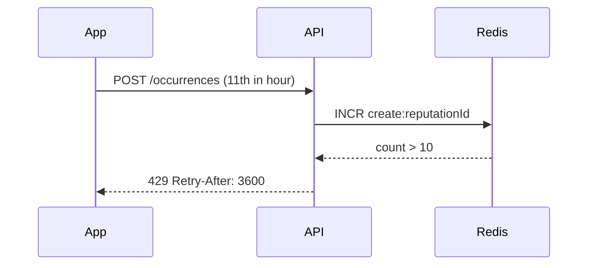

# Occurrence Creation — Flows

## 1. Primary flow — report from map (happy path)



---

## 2. Reject contributor GPS (security path)



---

## 3. Sensitive category create



---

## 4. City mismatch (IDOR prevention)



---

## 5. Approximate privacy at write

```mermaid
sequenceDiagram
    participant Domain as Occurrence
    participant Geo as LocationPrivacyService

    Domain->>Geo: shift(problemLocation, approximate_100)
    Geo->>Geo: random bearing, 100m offset
    Geo-->>Domain: shifted lat/lng
    Note over Domain: Store shifted coords for map;<br/>optionally retain true point in encrypted column (v2)
```

**v1 decision:** Store single pair — shifted coordinates when `privacyLevel = approximate`. True point recovery is **not** required for v1 (document in ADR if changed).

---

## 6. Rate limit exceeded



---

## Command catalog

### `CreateOccurrence`

| Property | Value |
|----------|-------|
| **Actor** | Authenticated contributor |
| **Idempotent** | No (each call creates new occurrence) |
| **Transaction** | Single DB transaction + outbox |

**Input (application DTO after Zod):**

```typescript
// Conceptual — not implementation
{
  category: string;
  description?: string;
  problemLocation: { latitude: number; longitude: number };
  privacyLevel: 'public' | 'neighborhood' | 'approximate' | 'hidden';
  occurrenceKind?: 'problem' | 'temporary_event';
  cityId?: string; // validated against session
}
```

**Plus from context (not client body):**

```typescript
{
  contributorRef: ContributorRef;
  resolvedCityId: string;
}
```

**Output:** `OccurrenceCreatedDto` + event `OccurrenceCreated`

**Errors:**

| Code | HTTP | When |
|------|------|------|
| `VALIDATION_ERROR` | 400 | Zod / domain VO failure |
| `INVALID_CATEGORY` | 400 | Unknown category |
| `DOXXING_DETECTED` | 400 | Description filter |
| `UNAUTHORIZED` | 401 | No session |
| `FORBIDDEN_CITY` | 403 | cityId mismatch |
| `RATE_LIMITED` | 429 | INV-O11 |

---

## Query catalog (creation slice)

Creation is write-only. Related read for UX:

| Query | Purpose |
|-------|---------|
| `GET /categories` | List allowed categories for city (cached) |
| `GET /occurrences/:id` | Confirm create — separate read slice (Phase 3) |

---

## Domain events

| Event | When | Consumers (future) |
|-------|------|-------------------|
| `OccurrenceCreated` | After persist | Territorial indexing, city health counters, notifications |
| `SensitiveOccurrenceCreated` | Subtype or flag on payload | Audit log, elevated review queue |

`OccurrenceCreated` payload (no PII):

```typescript
{
  occurrenceId: string;
  cityId: string;
  category: string;
  occurrenceKind: string;
  status: 'unverified';
  privacyLevel: string;
  isSensitive: boolean;
  occurredAt: Date;
}
```

---

## UI flows (presentation)

### Mobile / Web report wizard

```text
1. Pin on map (problem location)     → lat/lng
2. Select category                  → category + kind inferred
3. Optional description             → text
4. Privacy level selector           → privacyLevel
5. Identity mode (from Anonymity)   → read-only summary
6. Submit                           → POST /occurrences
7. Success                          → show id + "awaiting validation"
```

No step collects device GPS for storage — map pin is **problem** location only.

---

## Related docs

- [Business rules](business-rules.md)
- [Domain model](domain-model.md)
- [Anonymity flows](../anonymity/flows.md)
- [Occurrence lifecycle](../../system/occurrence-lifecycle.md)
