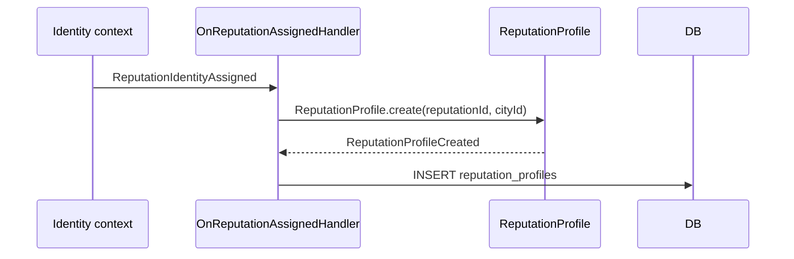
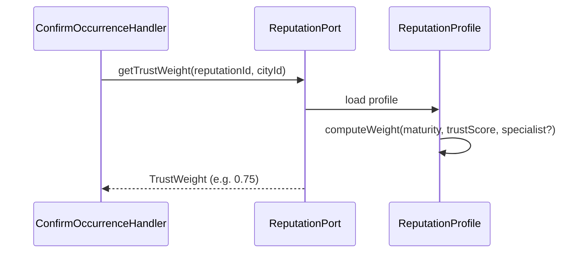
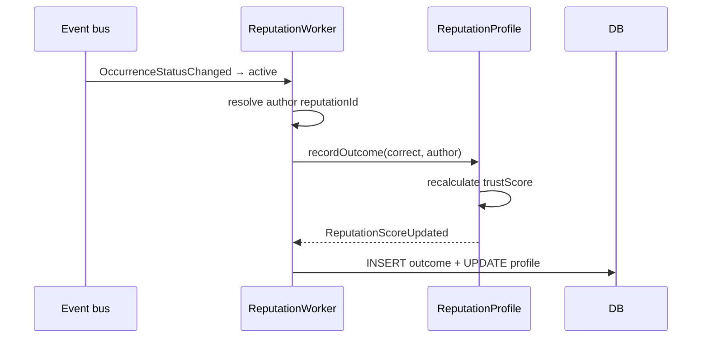
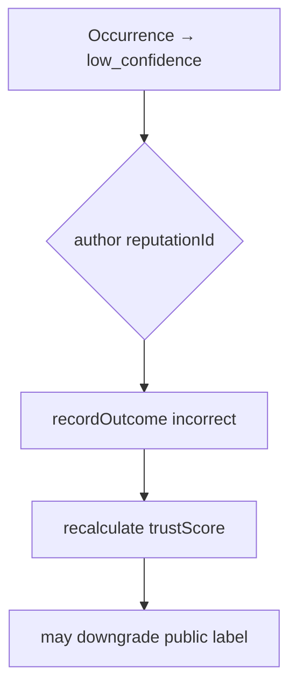
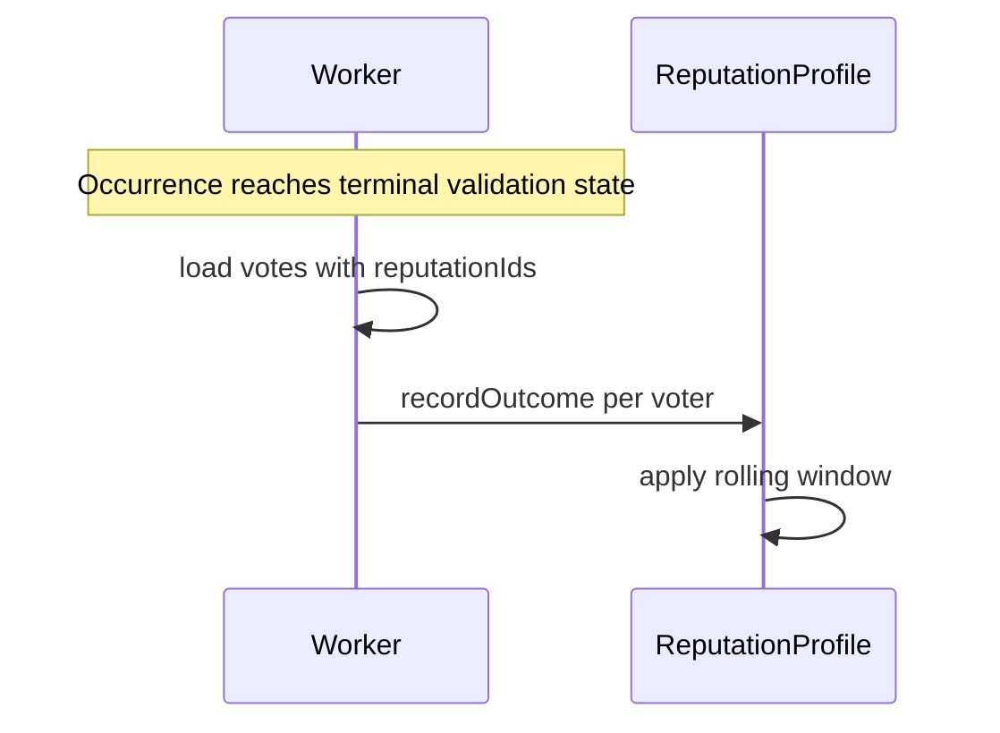
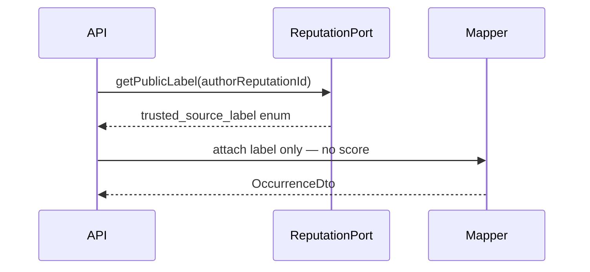
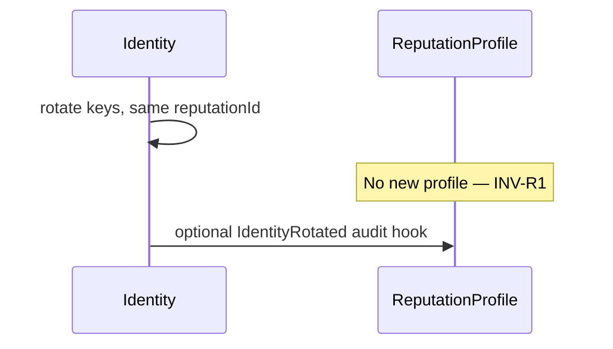
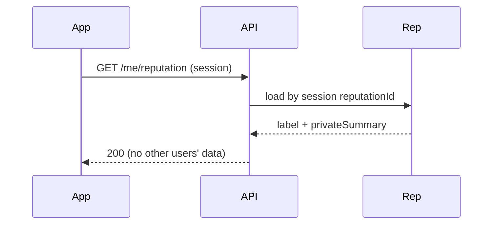

# Reputation — Flows

## 1. Profile creation (session bootstrap)

Triggered by `ReputationIdentityAssigned` from [Anonymity](../anonymity/flows.md).

Initial state: `trustScore = 0`, `totalOutcomes = 0`, label = `new_source`.

---

## 2. Trust weight lookup (validation path)

Consumed by [Community validation](../community-validation/flows.md).

**Query:** internal — not HTTP public in v1 (in-process port).

---

## 3. Record outcome — author report validated

When occurrence status becomes `active`:

Idempotent on `occurrenceId + outcomeType`.

---

## 4. Record outcome — author report rejected

When occurrence lands `low_confidence` and author was reporter:

---

## 5. Record validator outcome

When validator's confirm/deny is later proven right or wrong:

Example: voter confirmed, occurrence → `low_confidence` → voter outcome **incorrect**.

---

## 6. Public label on occurrence DTO

For sensitive categories: label may show `trusted_source` — **never** identity.

---

## 7. Identity rotation (score preserved)

---

## 8. Private summary for contributor

---

## Command catalog

| Command | Trigger | Actor |
|---------|---------|-------|
| `CreateReputationProfile` | `ReputationIdentityAssigned` | system |
| `RecordReputationOutcome` | domain events / worker | system |
| `RecalculateTrustScore` | after outcome batch | system |

No user-facing command to set score.

---

## Query catalog

| Query | HTTP | Actor |
|-------|------|-------|
| `GetTrustWeight` | internal port | Validation handlers |
| `GetPublicLabel` | internal port | DTO mappers |
| `GetMyReputationSummary` | `GET /me/reputation` | authenticated contributor |
| `GetReputationForAudit` | `GET /admin/reputation/:id` | security_audit role (v2) |

---

## Domain events consumed

| Event | Source | Action |
|-------|--------|--------|
| `ReputationIdentityAssigned` | Anonymity | create profile |
| `OccurrenceStatusChanged` | Occurrences | author outcomes |
| `OccurrenceConfidenceChanged` | Validation | threshold side effects |
| `OccurrenceConfirmed` / `Denied` | Validation | defer until terminal |
| `IdentityRotated` | Anonymity | audit only — same profile |

## Domain events emitted

| Event | Consumers |
|-------|-----------|
| `ReputationProfileCreated` | Analytics (aggregated) |
| `ReputationScoreUpdated` | Internal metrics — not public bus |
| `TrustedSourceLabelChanged` | Read model cache invalidate |

Payloads: **no PII**, no precise score on public bus.

---

## Related docs

- [Business rules](business-rules.md)
- [Domain model](domain-model.md)
- [Anonymity flows](../anonymity/flows.md)
