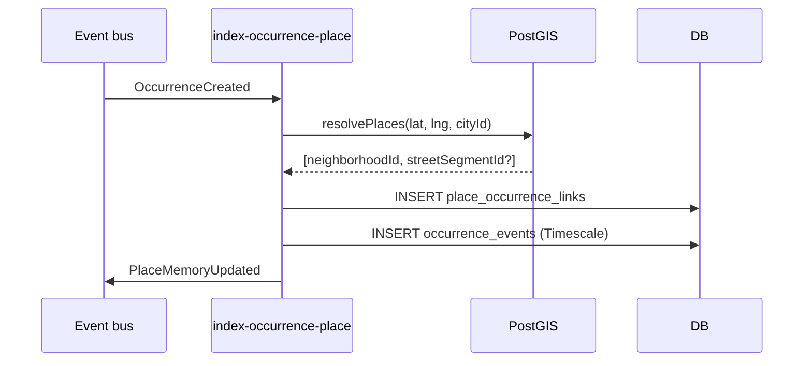
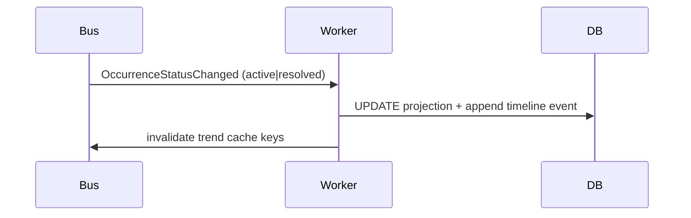
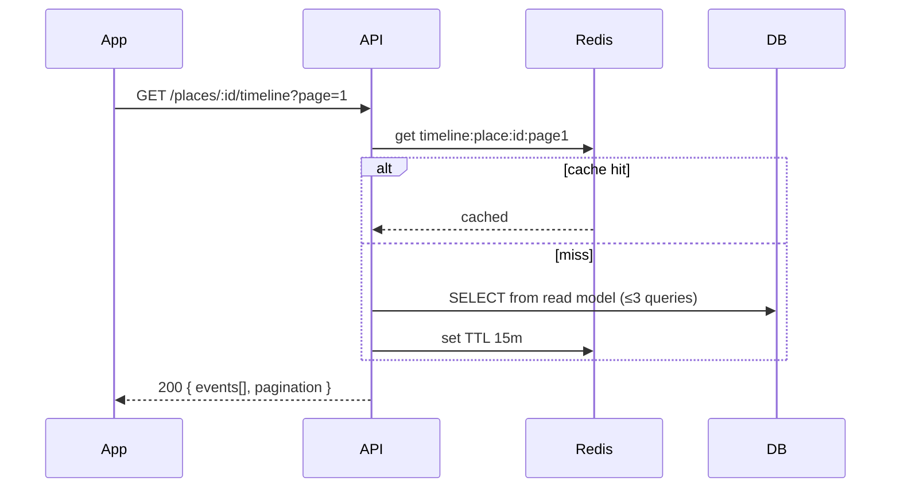
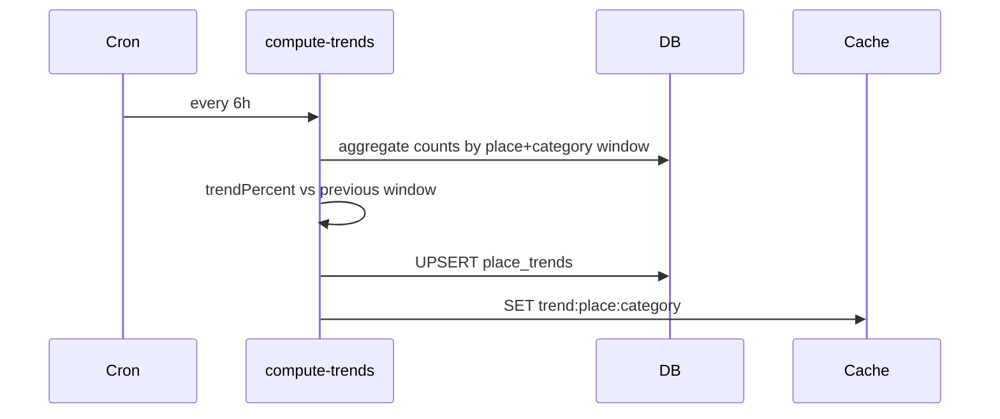
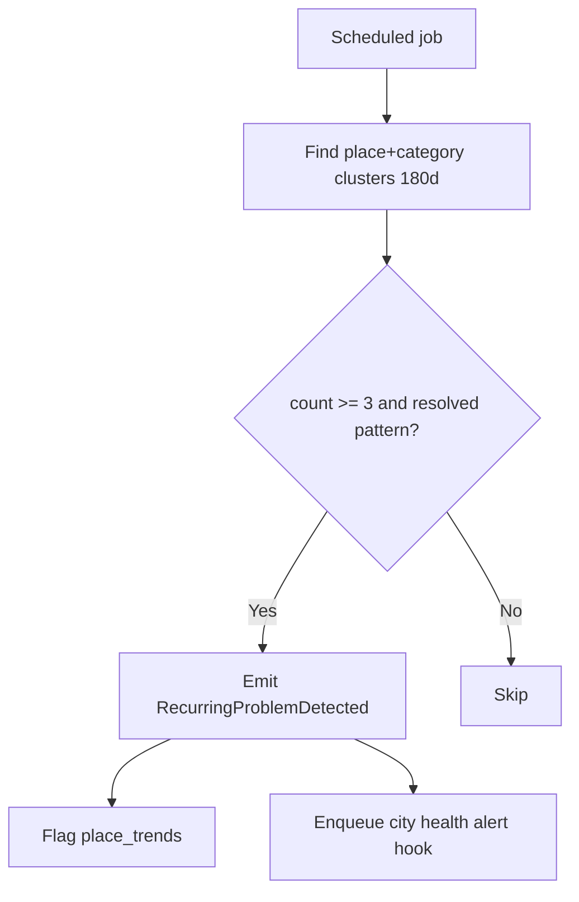
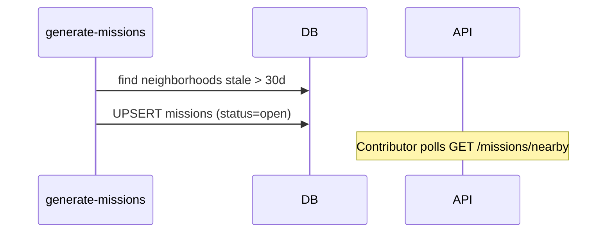
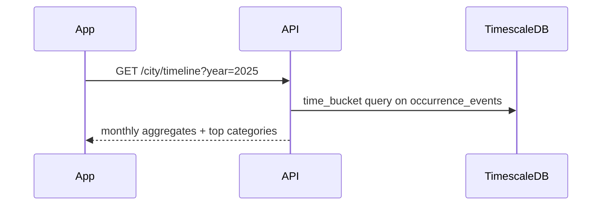

# Territorial Memory — Flows

## 1. Index occurrence on create (async)

Idempotent on `occurrenceId + sourceEventId`.

---

## 2. Update memory on status change

---

## 3. Place timeline query (read API)

Response DTOs apply privacy + sensitive author stripping.

---

## 4. Trend computation (scheduled worker)

---

## 5. Recurrence detection

---

## 6. Mission generation

---

## 7. City timeline by year

No per-reporter breakdown.

---

## Command catalog (system)

| Command | Trigger | Actor |
|---------|---------|-------|
| `IndexOccurrencePlaces` | `OccurrenceCreated` | worker |
| `UpdatePlaceMemory` | status events | worker |
| `ComputePlaceTrends` | cron | worker |
| `DetectRecurringProblems` | cron | worker |
| `GenerateMissions` | cron | worker |
| `UpsertPlace` | admin API | city_admin |

---

## Query catalog

| Query | HTTP |
|-------|------|
| `GetPlaceTimeline` | `GET /places/:id/timeline` |
| `GetPlaceTrends` | `GET /places/:id/trends?window=90d` |
| `GetCityTimeline` | `GET /city/timeline?year=` |
| `GetNearbyMissions` | `GET /missions/nearby?lat=&lng=` |
| `SearchPlaces` | `GET /places/search?q=` |

---

## Domain events

| Event | Consumers |
|-------|-----------|
| `PlaceMemoryUpdated` | City health worker |
| `PlaceTrendComputed` | Cache, notifications (future) |
| `RecurringProblemDetected` | City health, missions |
| `MissionCreated` | Mobile inbox |

---

## Related docs

- [Business rules](business-rules.md)
- [Domain model](domain-model.md)
