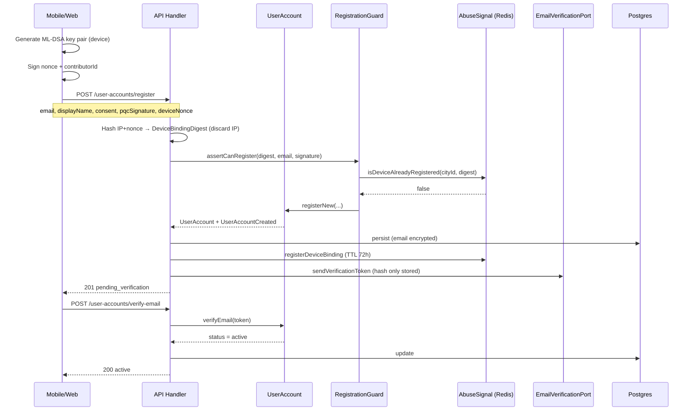
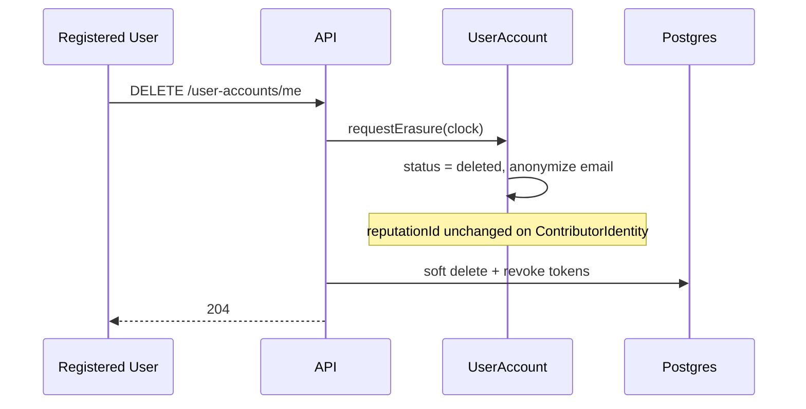

# User Account — Flows

## Primary happy path — optional account registration



---

## Alternative paths

### A1 — Device already has an account (INV-U3)

```text
register → Guard → Redis hit → 409 DEVICE_ALREADY_REGISTERED
```

The contributor may continue in ghost/pseudonym mode with the existing local session.

### A2 — Email already registered in city (INV-U4)

```text
register → Guard → email uniqueness → 409 EMAIL_ALREADY_USED
```

Offer session recovery flow (outside domain v1).

### A3 — Invalid PQC signature (INV-U6)

```text
register → PqcCryptoPort.verifyMlDsa → false → 400 INVALID_DEVICE_PROOF
```

### A4 — Missing or outdated LGPD consent (INV-U5)

```text
register → parseLgpdConsent → InvalidLgpdConsentError → 400
```

### A5 — Expired email token

```text
verifyEmail → EmailVerificationPolicy → 400 TOKEN_EXPIRED
Resend: rate limit 3/h per email hash
```

### A6 — LGPD erasure (Art. 18)



---

## Commands and queries

| Type | Name | Actor | Description |
|------|------|-------|-------------|
| Command | `RegisterUserAccount` | Ghost contributor | Start registration with guards |
| Command | `VerifyEmail` | Pending user | Activate account after token |
| Command | `ResendVerificationEmail` | Pending user | Resend token (rate limited) |
| Command | `UpdateDisplayName` | Active user | Update display name |
| Command | `RevokeLgpdConsent` | Active user | Suspend until new consent |
| Command | `RequestErasure` | Active user | LGPD erasure |
| Query | `GetMyAccount` | Active user | Return profile (no email in logs) |
| Query | `ExportPersonalData` | Active user | LGPD portability |

---

## Domain events emitted

| Event | When | Payload (no PII) |
|-------|------|------------------|
| `UserAccountCreated` | After register | `userAccountId`, `cityId`, `contributorId`, `status: pending_verification` |
| `EmailVerified` | After verify | `userAccountId`, `cityId`, `contributorId` |
| `UserAccountErasureRequested` | LGPD delete | `userAccountId`, `cityId`, `requestedAt` |
| `LgpdConsentRevoked` | User revokes | `userAccountId`, `cityId`, `consentVersion` |

> Event bus **never** carries email, IP, device digest, or display name.

---

## Integration with ContributorIdentity

```text
1. ContributorIdentity.bootstrap() — ghost session (implemented)
2. UserAccount.registerNew(contributorId) — optional
3. ContributorIdentity.linkPublicProfile(userAccountId) — future handler
4. changeMode('public') — only when UserAccount.status = active
```

---

## Related docs

- [Business rules](business-rules.md)
- [Domain model](domain-model.md)
- [Anonymity flows](../anonymity/flows.md)
